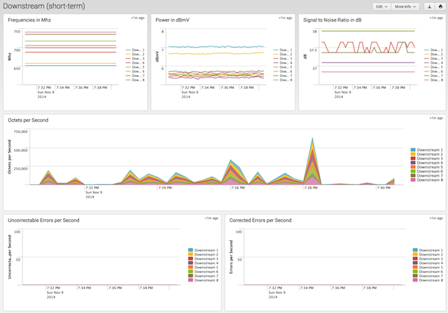
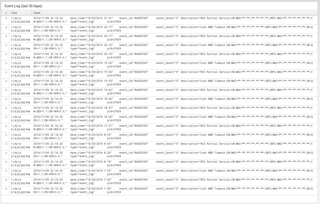

# Splunk Modem Monitor

A Splunk app to monitor your cable modem.  I wrote it due to having some trouble with my cable modem a little while back, as well as to see how the characteristics of the modem's frequency user, power, and signal-to-noise ration can change over time.

At present, the Arris TG852G modem is supported.

**tl;dr** Monitor metics 
Keep track of your cable modem's behavior and get pretty graphs like these:

 

## What's Splunk?

Splunk is an amazing app that lets you monitor your logfiles and perform analytics on them.  You can monitor other kinds of data, such as the output of the ping command, which is what this app does.  A free copy of Splunk Enterprise [can be downloaded at Splunk.com](http://www.splunk.com/)

## Installation

This assumes you are running this on a machine with Vagrant and Virtual box installed.  If you are running this on a machine 
that has already been created, simply remove the references to Vagrant.

- Download this app:
	- `git clone git@github.com:dmuth/splunk-modem-monitor.git`
- Start Vagrant with `vagrant up`
- SSH into the Vagrant instance with `vagrant ssh`
- Install PHP with `sudo apt-get update && sudo apt-get -y install php5-cli php5-curl`
- Install Splunk with `sudo /vagrant/bin/install_splunk.sh`
    - Agree to the license and then watch Spkunk start
    - **Note:** you'll need a Splunk .deb file named `splunk.deb` in the current directory
- Deploy this app:
	- `sudo /vagrant/bin/deploy_symlink.sh $SPLUNK_ROOT` if you'd like to have a symlink pointing to this directory
	- `sudo /vagrant/bin/deploy.sh $SPLUNK_ROOT` if you'd like to have this directory copied into $SPLUNK_HOME/Network-Monitor/
- Restart Splunk:
    - `sudo $SPLUNK_HOME/bin/splunk restart`
- Log into Splunk on [http://localhost:8000/](http://localhost:8000/) and click "App: Modem Monitor" to see your connectivity reports.

## Usage

While in Splunk, click "App" and then "Modem Monitor".

There will be a menu across the top that lets you run reports.

## How does it work?

At its core, this app calls a script called `arris.php`.  It connects to the URL **http://192.168.100.1/cgi-bin/status_cgi** every 10 seconds.  This URL is an extra IP on your modem which returns a status page full of technical info about the channels your cable modem is using, their power, signal-to-noise ratio, and other neat telemetry.  The PHP script parses this data and returns it to Splunk in key/value pairs, which Splunk can natively understand.

## Compatibility

This has been written for (and tested on) Splunk 6.2

Splunk 6.2, in turn, has been tested on Ubuntu 14.04 LTS and Macintosh OS/X 10.8.5.

## TODO

Things I might implement in the future:

- Scripts to read the status pages of other modems (if anyone can send me the status pages from other modems, hint hint!)
- Monitor the PacketCable events. I would need to refactoring the existing Event Log code and probably split it into a spearate PHP script with configuration in a third file.

    
## Questions, comments, abuse, and offers of employment

Hit me up via email at dmuth@dmuth.org.
